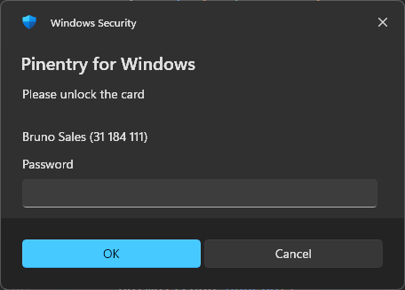

= Pinentry For Windows

`Pinentry For Windows` is a native Windows pinentry implementation for GnuPG.
It speaks the Assuan protocol expected by `gpg-agent`, reads commands from standard input, writes Assuan responses to standard output, and uses Windows-native UI for passphrase and confirmation prompts.

== Preview

== Installation

Install the latest release with PowerShell:

[source,powershell]
----
irm https://raw.githubusercontent.com/baliestri/pinentry-for-windows/main/install.ps1 | iex
----

The installer detects the current Windows architecture, downloads the matching executable from the latest GitHub release, installs it into the GnuPG `bindir`, updates `gpg-agent.conf`, and restarts `gpg-agent`.
If `gpg-agent.conf` already has a `pinentry-program` entry, the installer asks before replacing it.

Use a script block invocation when passing options to the streamed installer:

[source,powershell]
----
& ([scriptblock]::Create((irm https://raw.githubusercontent.com/baliestri/pinentry-for-windows/main/install.ps1))) -Update
----

Supported installer options:

* `-Update` downloads the latest release and replaces the installed executable.
* `-Uninstall` removes the installed executable and prompts before removing or restoring the `pinentry-program` setting.
* `-NoRestartAgent` skips `gpg-agent` restart after configuration changes.
* `-InstallDirectory <path>` installs to or uninstalls from a specific directory instead of the GnuPG `bindir`.

Examples:

[source,powershell]
----
& ([scriptblock]::Create((irm https://raw.githubusercontent.com/baliestri/pinentry-for-windows/main/install.ps1))) -Update -NoRestartAgent
& ([scriptblock]::Create((irm https://raw.githubusercontent.com/baliestri/pinentry-for-windows/main/install.ps1))) -Uninstall
& ([scriptblock]::Create((irm https://raw.githubusercontent.com/baliestri/pinentry-for-windows/main/install.ps1))) -InstallDirectory "$env:LOCALAPPDATA\PinentryForWindows"
----

== Features

* Native Windows passphrase entry through `CredUIPromptForWindowsCredentials`.
* Native Windows message and confirmation dialogs through `TaskDialog`.
* External passphrase cache support through Windows `PasswordVault` when GnuPG sends `OPTION allow-external-password-cache`.
* Windows Hello gate for reading cached passphrases through `KeyCredentialManager`.
* Best-effort cache behavior: cache read/store failures never prevent a normal prompt fallback.
* User-controlled cache opt-in via a "Remember my credentials" checkbox, enabled through a local settings file.
* Assuan payload logging with redaction enabled.
* Diagnostic log file at `%LOCALAPPDATA%\PinentryForWindows\pinentry.log`.
* Smart card description cleanup and cache-user extraction from `SETDESC` values.
* Repeat-passphrase flow with mismatch warning and Assuan error response.
* Console transport for the Assuan session over `stdin` and `stdout`.
* Native AOT and trimming-ready Windows executable configuration.
* Unit, process integration, GPG agent compatibility replay, protocol smoke, interactive UI, cache, and optional GPG smoke tests.

== How It Works

GnuPG starts the executable configured as `pinentry-program` and communicates with it through Assuan commands.
`PinentryForWindows.exe` hosts an Assuan server over its console streams and registers handlers for the pinentry commands used by `gpg-agent`.

When a passphrase is required, `GETPIN` opens the Windows credential UI.
If external caching is enabled and a cache key is known, the application first tries to read the passphrase from Windows `PasswordVault`.
Cache reads are protected by Windows Hello.
If Windows Hello, `PasswordVault`, or cache lookup fails, the application falls back to a normal credential prompt.

== Requirements

* Windows 10 version 2004 / build 19041 or later.
* .NET SDK 10.0 or later for building from source.
* GnuPG for real `gpg-agent` integration.
* Windows Hello is optional, but required for `PASSWORD_FROM_CACHE` cache-hit responses.

== GnuPG Configuration

Build or publish `PinentryForWindows.exe`, then configure `gpg-agent.conf`:

[source,text]
----
pinentry-program C:/path/to/PinentryForWindows.exe
----

After changing `gpg-agent.conf`, restart the agent:

[source,powershell]
----
gpgconf --kill gpg-agent
----

Use forward slashes or escaped backslashes in the path.

== Building

Restore and build the solution:

[source,powershell]
----
dotnet restore PinentryForWindows.slnx
dotnet build PinentryForWindows.slnx --configuration Debug
----

The debug executable is usually written under:

[source,text]
----
src/PinentryForWindows/bin/Debug/net10.0-windows10.0.19041.0/win-x64/PinentryForWindows.exe
----

== Publishing

The application project is configured for Windows native publishing:

* `PublishAot=true`
* `PublishTrimmed=true`
* CsWin32-generated `TaskDialogIndirect` bindings for Windows dialogs
* Windows application manifest with Common Controls v6
* native libraries included for self-extraction
* single-file compression enabled

Publish for `win-x64`:

[source,powershell]
----
dotnet publish src/PinentryForWindows/PinentryForWindows.csproj --configuration Release --runtime win-x64
----

== Supported Assuan Commands

[cols="1,3", options="header"]
|===
| Command | Behavior

| `BYE`
| Sends `OK closing connection` and closes the session.

| `CLEARPASSPHRASE <key>`
| Removes `pfwcache:<key>` from Windows `PasswordVault`.

| `CONFIRM`
| Shows a native confirmation dialog using the current title, description, OK text, and Cancel text.

| `CONFIRM --one-button`
| Shows a native informational dialog and returns `OK`.

| `GETINFO version`
| Returns the executing assembly version.

| `GETINFO pid`
| Returns the current process id.

| `GETINFO flavor`
| Returns `pinentry-for-windows`.

| `GETINFO ttyinfo`
| Returns `CONOUT$ w32`.

| `GETPIN`
| Returns a passphrase from cache or opens the Windows credential UI.

| `MESSAGE [text]`
| Shows a native informational dialog. Uses command text when present, otherwise the current description.

| `OPTION <name>[=<value>]`
| Handles supported pinentry options and ignores unknown options with `OK`.

| `RESET`
| Restores all session state defaults.

| `SETCANCEL <text>`
| Sets the Cancel button text. `_` is converted to `&` for Windows access keys.

| `SETDESC <text>`
| Sets the prompt description and extracts cache-user metadata when possible.

| `SETERROR <text>`
| Sets an error message that is prepended to the next `GETPIN` prompt and skips cache lookup once.

| `SETKEYINFO <key>`
| Sets the key info used for the cache key and default credential user.

| `SETKEYINFO --clear`
| Clears the current key info.

| `SETNOTOK <text>`
| Sets the Not OK button text. `_` is converted to `&`.

| `SETOK <text>`
| Sets the OK button text. `_` is converted to `&`.

| `SETPROMPT <text>`
| Stores the prompt label in session state.

| `SETREPEAT <text>`
| Enables repeat-passphrase mode and sets the repeat prompt description.

| `SETREPEATERROR <text>`
| Sets the warning text shown when repeated passphrases do not match.

| `SETTIMEOUT <seconds>`
| Stores a numeric timeout value when one is provided. Invalid values are ignored and still return `OK`.

| `SETTITLE <text>`
| Sets the dialog title.
|===

Invalid arity for commands that require specific arguments returns `ERR 67109144`.
Canceled prompts return `ERR 83886179`.
Repeat mismatch returns `ERR 83886194`.

== Supported Options

[cols="1,3", options="header"]
|===
| Option | Behavior

| `allow-external-password-cache`
| Enables use of Windows `PasswordVault` for the session.

| `default-ok=<text>`
| Sets the OK button text. `_` is converted to `&`.

| `default-cancel=<text>`
| Sets the Cancel button text. `_` is converted to `&`.

| `default-notok=<text>`
| Sets the Not OK button text. `_` is converted to `&`.

| `default-prompt=<text>`
| Sets the prompt label.

| `grab`
| Marks keyboard grab as requested in session state.

| `no-grab`
| Clears keyboard grab in session state.
|===

Unknown options are accepted and ignored.

== Passphrase Prompts

`GETPIN` chooses the credential user in this order:

* cache user extracted from `SETDESC`
* current `SETKEYINFO` value
* current title

The prompt message is built from the current description.
If `SETERROR` was sent, its text is prepended to the next prompt and then cleared.
`SETERROR` also prevents that `GETPIN` call from using cached credentials.

== External Cache And Windows Hello

External caching is enabled only after `OPTION allow-external-password-cache`.
The cache key is built as `pfwcache:<SETKEYINFO value>`.
If `SETKEYINFO` is empty, no cache lookup or store is attempted.

Cache read flow:

* find credentials in Windows `PasswordVault`
* unlock the cache read with Windows Hello
* return `S PASSWORD_FROM_CACHE`, `D <passphrase>`, and `OK`

Cache write flow:

* after a successful non-repeat `GETPIN`, store the passphrase in `PasswordVault`
* replace any existing credential for the same cache key
* ignore store failures and keep the successful `GETPIN` response

Cache cleanup uses `CLEARPASSPHRASE <key>` and removes `pfwcache:<key>`.

Windows Hello is best-effort.
If it is unavailable, cancelled, or fails, `GETPIN` falls back to a normal credential prompt.

The threat model, security goals, non-goals, known limitations, and follow-up hardening tasks are documented in link:docs/security-model.adoc[docs/security-model.adoc].
GPG key identity sources, cache key construction, and display label rules are documented in link:docs/gpg-agent-key-identity.adoc[docs/gpg-agent-key-identity.adoc].

== User Cache Opt-In

By default, passphrase caching is controlled entirely by `gpg-agent` via `OPTION allow-external-password-cache`.
When user cache opt-in is enabled, the passphrase prompt includes a native "Remember my credentials" checkbox.
Checking the checkbox stores the passphrase in Windows `PasswordVault` using the same DPAPI-encrypted, Windows Hello-gated path as the standard cache.

User cache opt-in is disabled by default and must be explicitly enabled.
To enable it, create:

[source,text]
----
%LOCALAPPDATA%\PinentryForWindows\settings.json
----

with the following content:

[source,json]
----
{
  "AllowUserCacheOptIn": true
}
----

When enabled:

* If a stable cache key is known (`SETKEYINFO` was sent), the prompt shows a "Remember my credentials" checkbox.
* Checking the checkbox stores the passphrase in `PasswordVault` after the prompt succeeds.
* Unchecking the checkbox (or leaving it unchecked) does not store the passphrase, regardless of `gpg-agent` settings.
* Repeat-passphrase prompts never show the checkbox.
* The checkbox does not appear when no cache key is available.

The stored passphrase is protected identically to the standard cache path: DPAPI-encrypted at rest and gated by Windows Hello on the next cache read.
Cache entries written by opt-in and by `gpg-agent`-managed caching share the same storage and are cleared by `CLEARPASSPHRASE`.

== Smart Card And Metadata Parsing

`SETDESC` recognizes metadata commonly sent by GnuPG and smart card flows.

It can extract the cache user from:

* key ids matching `ID <16 hexadecimal characters>`
* MAC-like values with 16 colon-separated bytes
* smart card `Holder:` and `Number:` lines

For smart card descriptions, `Number:` and `Holder:` lines are removed from the user-facing description.
The extracted cache user is formatted as:

[source,text]
----
Holder (Number)
----

when both values are present.

== Repeat Passphrase Flow

`SETREPEAT <text>` enables repeat-passphrase mode.
The next `GETPIN` prompts twice:

* first prompt uses the normal title and description
* second prompt uses `<title> - Repeat` and the repeat description

If both values match, the response is:

[source,text]
----
S PIN_REPEATED
D <passphrase>
OK
----

If they do not match, a warning dialog is shown and the response is `ERR 83886194 PIN not repeated`.

== CLI Commands

`PinentryForWindows.exe` supports operational commands that exit without starting the Assuan server.

=== Diagnostics

[source,powershell]
----
PinentryForWindows.exe --check
----

Checks and reports the following:

* Windows Hello support
* Windows `PasswordVault` access and number of cached entries
* Log directory writability
* Settings file (`AllowUserCacheOptIn` value)
* GnuPG `pinentry-program` configuration (requires `gpgconf` in `PATH`)

Each item is reported as `[OK]`, `[WARN]`, or `[FAIL]`.
Warnings do not affect the exit code.
Exit code is `0` if all checks pass, `1` if any check fails.
Passphrases and cached secrets are never printed.

=== Cache Management

Clear all cached passphrases owned by PinentryForWindows:

[source,powershell]
----
PinentryForWindows.exe --clear-cache
----

Clear a specific cache entry by key (the same value as the argument to `SETKEYINFO`):

[source,powershell]
----
PinentryForWindows.exe --clear-cache n/AABBCCDDEEFF0011
----

Only entries prefixed with `pfwcache:` in Windows `PasswordVault` are affected.
Unrelated Windows credentials are never touched.
Exit code is always `0`.

== Logging

Diagnostic logs are written to:

[source,text]
----
%LOCALAPPDATA%\PinentryForWindows\pinentry.log
----

Logging behavior:

* records `Debug` and higher levels, excluding `None`
* uses Assuan redacted payload logging
* normalizes line breaks to keep one log entry per line
* includes exception details when available
* never throws back into pinentry if the log file cannot be written

== Testing

Run the automated .NET test suite:

[source,powershell]
----
dotnet test PinentryForWindows.slnx
----

The test project uses xUnit v3, Shouldly, Moq, and process-level integration tests.
Parallelization is disabled because command handlers share session state.
GPG agent compatibility replay tests are documented in link:docs/gpg-agent-compatibility-tests.adoc[docs/gpg-agent-compatibility-tests.adoc].

Run protocol smoke tests through the PowerShell script:

[source,powershell]
----
pwsh -NoProfile -ExecutionPolicy Bypass -File tests/Test-PinentryForWindows.ps1
----

Useful script switches:

[cols="1,3", options="header"]
|===
| Switch | Behavior

| `-NoBuild`
| Skip the build and use an existing executable.

| `-Restore`
| Run `dotnet restore` before building.

| `-Configuration <name>`
| Select the build configuration. Defaults to `Debug`.

| `-Runtime <rid>`
| Select the runtime identifier. Defaults to `win-x64`.

| `-ExpectedPin <pin>`
| Sets the PIN/passphrase expected by interactive scenarios. Defaults to `123456`.

| `-Interactive`
| Runs manual `GETPIN`, CredUI, cache, Windows Hello, repeat, and cache cleanup scenarios.

| `-RequireWindowsHelloCache`
| Fails the cache-hit scenario if it falls back to a normal prompt instead of returning `S PASSWORD_FROM_CACHE`.

| `-IncludeDialogTests`
| Runs manual `MESSAGE` and `CONFIRM --one-button` dialog scenarios.

| `-IncludeCancelTests`
| Runs a manual cancellation scenario for `GETPIN`.

| `-IncludeGpgKeyTests`
| Creates a temporary `GNUPGHOME`, generates a throwaway GPG key, signs a message, then cleans up.
|===

Example interactive run:

[source,powershell]
----
pwsh -NoProfile -ExecutionPolicy Bypass -File tests/Test-PinentryForWindows.ps1 -Interactive
----

If Windows Hello is not available, the cache-hit interactive scenario can pass with a warning because the application correctly falls back to a normal prompt.

== Release Automation

The repository includes GitHub Actions workflows for release preparation:

* `.github/workflows/generate-changelog.yml` creates a release branch, generates `CHANGELOG.md` with `git-cliff`, tags the version, and merges into `main` and `develop`.
* `.github/workflows/release-tag.yml` publishes Windows `win-x64` and `win-x86` binaries as release `.exe` assets, generates `SHA256SUMS.txt`, and creates the GitHub release from changelog notes.

The changelog configuration expects Conventional Commits.

== Operational Notes

* The executable is designed to be launched by `gpg-agent`, not used as a long-running background service.
* Communication happens over standard input and standard output.
* When standard input closes during an interactive prompt, the console transport waits for the prompt to complete before sending `BYE`.
* `grab` and `no-grab` are tracked in session state, but keyboard grabbing is not implemented by the Windows UI layer.
* `SETTIMEOUT` stores timeout values, but prompt timeout enforcement is not implemented by the credential UI layer.
* Cache and logging are intentionally best-effort so diagnostic or platform failures do not block passphrase entry.

== License

This project is licensed under the MIT License.
See link:LICENSE.md[LICENSE] for details.
